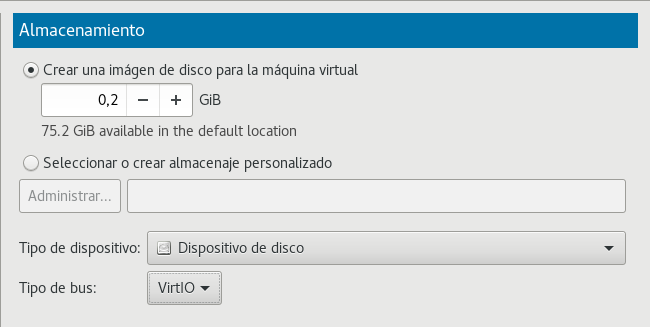

## Gestión de Volúmenes Lógicos

***

### Que són: 

La gestión de volúmenes lógicos o ***logical volum manager (LVM)*** , es una implementación de un administrador de volúmenes lógicos para el kernel Linux. 

***

### Tipologias de gestión volúmenes lógicos:  

* **PV:** Las siglas significan ***Physical volume.*** Es lo que llamariamos la identificación de los discos. A la hora de crear un PV puedes hacerlo tanto con discos normales como con raids.  
* **Como crear un PV:** `pvcreate /dev/sda`  
* **Comprovar que se ha creado el PV:** Ejecutamos el comado pvs para ver si se ha creado.

* **VG:** Las siglas significan ***Volume group.*** Serian unos discos virtuales. Cuando creas un grupo de volúmenes este coje todos los gigabytes de los dicos que tenga y los utiliza todos, no como algunos raids. Se le pueden añadir o quitar discos en caliente y esta creado de uno o varios LV.  
* **Como crear un VG:** `vgcreate "nombre que le queramos dar" "Pv: los que queramos añadir"`
* **Comprovar que se ha creado el VG:** Ejecutamos el comado vgs para ver si se ha creado.

* **LV:** Las siglas significan ***Logical volume.*** Son las particiones te quedan al final creadas. Aqui es donde tenemos de crear y montar el sistema de ficheros que queramos tener. Tenemos de tener en cuenta que por cada VG podemos crear mas de un LV.      
* **Como crear un LV:** `lvcreate -L "el tamaño que le queremos dar del VG" -n "el nombre que le queramos dar" "del VG que lo queramos crear"`
* **Comprovar que se ha creado el LV:** Ejecutamos el comado lvs para ver si se ha creado.

***

### Entorno de prácticas:

* En esta práctica crearemos desde cero para una máquina virtual varios disdcos duros de 200M y con estos haremos tanto volúmenes físicos, grupos de volúmenes y volúmens lógicos. Tambien crearemos y montaremos varios sistemas de ficheros. Y ademas redimensionaremos tanto los volúmenes lógicos como los sistemas de ficheros.  

  

***

### Práctica 1 :  

1. **Creamos un PV:** `pvcreate /dev/vda`
2. **Ejecutamos pvs para ver si se ha creado:** `pvs`
3. **Creamos el VG:** `vgcreate practica1 /dev/vda`
